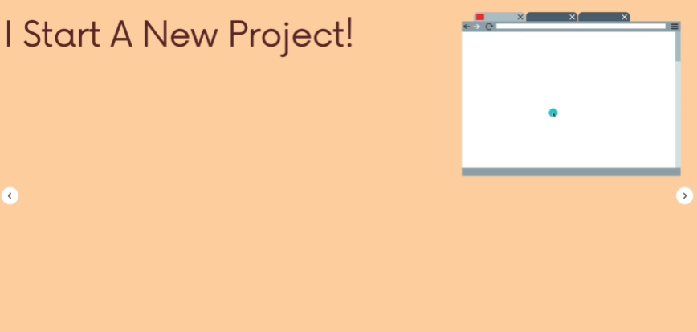
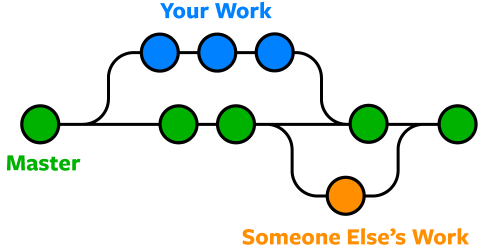

# temario Git & Github

## Introducción al temario de Git y GitHub para el curso de Análisis y Diseño de Sistemas II

---

## Tabla de contenido

| Secciones                                                    | Contenido                                                    |
| ------------------------------------------------------------ | ------------------------------------------------------------ |
| 1. Introducción a los Sistemas de Control de Versiones (VCS) | 1. ¿Qué es Git y para qué lo utilizamos?                     |
|                                                              | 2. Un poco de historia de Git                                |
|                                                              | 3. ¿Cómo maneja Git nuestros archivos?                       |
|                                                              | 4. Instalación y configuración de Git en nuestra computadora |
|                                                              | 5. Trabajar con Git vs. Trabajar sin Git                     |
|                                                              | 6. Conceptos básicos de Git                                  |
|                                                              | 7. Estados de un archivo administrado por Git                |
|                                                              | 8. ¿Qué es el .git y el .gitignore?                          |
|                                                              | 9. Consejos y recomendaciones                                |
|                                                              | 10. Práctica #1. utilizando Git (Local)                      |
| 2. Mejorando el dominio de Git                               | 11. Trabajar con diferentes ramas en Git                     |
|                                                              | 12. Qué hacer cuando tenemos conflictos en nuestro código?   |
|                                                              | 13. Flujos de trabajo más comúnes (Git Workflow)             |
|                                                              | 14. Herramientas integradas en IDEs y editores de texto      |
|                                                              | 15. Consejos y recomendaciones                               |
|                                                              | 16. Práctica #2. utilizando Git (Local)                      |
| 3. Trabajando con repositorios remotos de GitHub             | 17. ¿Qué es GitHub?, ¿Relación entre Git y GitHub?           |
|                                                              | 18. Explorar e interactuar con GitHub                        |
|                                                              | 19. Trabajar con repositorios locales y remotos              |
|                                                              | 20. Colaboraciones a otros proyectos                         |
|                                                              | 21. Pull request, Fork, Clone                                |
|                                                              | 22. Trabajar con GitHub Pages                                |
|                                                              | 23. GitHub Actions                                           |
|                                                              | 24. GitHub Education                                         |
|                                                              | 24. Recomendaciones y consejos                               |
|                                                              | 25. Práctica #3. utilizando Git & GitHub (Colaborativa)      |
| Referencias                                                  |                                                              |

## 1. Introducción a los Sistemas de Control de Versiones (VCS)

#### 1.1. ¿Qué es Git y para qué lo utilizamos?

**Git es un sistema de control de versiones (Version Control System)**, básicamente es un software que nos ayuda a administrar y hacer seguimiento de los cambios que sufre nuestro software en su proceso de desarrollo, al incorporar Git en nuestros proyectos tendremos la posibilidad de comprarar cambios, revisitar cambios realizados previamente, reestablecer versiones anteriores, revertir cambios y trabajar con diferentes flujos de trabajo con un enfoque organizado y escalable.

Los sistemas de control de versiones son ampliamente utilizados en la industria del desarrollo de software, si bien podríamos decir que Git es el más utilizado, también debemos aclarar que no es el único de su clase, existe en el mercado gran variedad entre los cuales se encuentran: CVS, SVN, Mercurial, Monótono, BaseCon, Subversion, entre otros.

#### 1.2. Un poco de historia de Git

Linus Torvalds es un Ingeniero de Software, esta persona fue el creador y mayor contribuyente en lo que hoy en día es el sistema de control de versiones Git.
En 2005, mientras trabaja en Linux, llegó a un punto de frustración con los sistemas de control de versiones que habían en el momento, algunas de ellas muy lentas, poco eficientes y en su mayoría de pago.

Torvalds quería un sistema de control de versiones rápido, eficiente, de código abierto y gratuito para la comunidad de desarrolladores, inicialmente tenía muy baja popularidad debido a las pocas funcionalidades que incorporaba, pero de a poco su popularidad fue ganando terreno, 15 años después, en el año 2020, por encima del 90% de los desarrolladores de todo el mundo utilizan Git como su sistema de control de versiones preferido.

**¿Quién utiliza Git actualmente?** Git es ampliamente usado en la industria del desarrollo de software, pero también lo utilizan personas que no tienen nada que ver con código, como por ejemplo algunos gobiernos lo utilizan para tener el control a lo largo del tiempo de sus leyes, escritores lo utilizan para tener un control sobre aquello que escriben, científicos y grupos de investigación lo utilizan también para tener un recuento de sus investigaciones, y en general, cada vez es mayor la necesidad de incorporar Git para administrar el versionamiento de documentos y archivos.

#### 1.3. ¿Cómo maneja Git nuestros archivos?

> Copias instantáneas, no diferencias

La principal diferencia entre Git y cualquier otro VCS (incluyendo Subversion y sus amigos) es la forma en la que manejan sus datos. Conceptualmente, la mayoría de los otros sistemas almacenan la información como una lista de cambios en los archivos. Estos sistemas (CVS, Subversion, Perforce, Bazaar, etc.) manejan la información que almacenan como un conjunto de archivos y las modificaciones hechas a cada uno de ellos a través del tiempo, en la siguiente imágen se expone claramente.

#### 1.4. Instalación y configuración de Git en nuestra computadora

a. Para instalar Git debemos [ir al sitio web oficial.](https://git-scm.com/)

Descargar la versión para su sistema operativo, e instalarlo como cualquier otra aplicación, con la configuración por defecto que ofrece Git será suficiente para empezar a controlar las versiones de nuestro software, en el proceso de instalación se le solicitará elegir si desea instalar la consola (Bash) y la interfaz gráfica (GUI), durante todo el documento se exponenen los ejemplos por medio de la consola de Git, queda entonces a elección del lector elegir si desea tener la GUI (Es completamente opcional).

b. Una vez instalado Git se debe configurar la identidad de quién estará utilizando Git, esto se da por que estaremos habilitados para trabajar colaborativamente y se necesita identificar los cambios de cada intregrante del equipo de desarrollo, para esto, se debe abrir la consola de Git.

Una vez se abre la consola, escribir los siguientes comandos:

Para configurar tu nombre: `git config --global user.name "Tu nombre completo"`.

Para configurar tu correo: `git config --global user.email tucorreo@ejemplo.com`.

Una vez tengas esta configuración lista estaremos listos para comenzar a trabajar con Git.

#### 1.5. Trabajar con Git vs. Trabajar sin Git

Como ya lo sabemos, trabajar con Git nos habilita para tener gran control sobre los cambios que va teniendo nuestro código a medida que éste empieza a volverse más y más complejo, y esto nos lleva a la pregunta, ¿Cómo hemos desarrollado nuestros proyectos de desarrollo sin perder la capacidad de seguir avanzando de forma contínua hasta llegar a nuestro objetivo de tener un software funcional?

Mirémoslo con un simple ejemplo: Un documento de word

Hasta el momento lo hemos hecho así...

Luego avanzas un poco más, pero quieres tener el documento exactamente como está arriba, por lo cual sacas una copia de esta y sigues trabajando en otro documento...

Y así un poco más hasta que en determinado momento tienes algunas copias más en tu computadora...

Y cuando estás acabando el proyecto tienes un _montón_ de archivos y posiblemente llegaste al punto de volverte loco por el desorden y la falta de organización de las versiones de tu trabajo escrito, en este punto tu directorio de archivos se vería así:

Lo mismo hacemos generalmente con nuestro código de forma local en nuestra computadora, cuando consideramos tener un buen avance en nuestro proyecto hacemos copias y las alojamos en un lugar seguro, como por ejemplo el correo electrónico, para que, en caso de tener una falla o inconsistencia en el código actual, podamos retornar a una versión previa y partir de nuevo desde allí.

#### **Entonces... ¿Cómo Git nos ayuda a combatir este problema?**

De forma conceptual, Git trabaja por medio de **_Checkpoints_**, los cuales vamos generando a medida que avanzamos en el desarrollo de nuestro código, con la posibilidad de regresar en estos checkpoints, algo así como una máquina del tiempo...

Veamos un ejemplo bastante gráfico:

a. Imaginemos que vamos a trabajar en un sitio web...

Nuestro primer Checkpoint será el del inicio, el cual tendrá el nombre: **Se inicializó el proyecto**

Luego avanzamos un poco más y realizamos la barra de navegación de nuestro sitio web, con lo cual decidimos registrar este avance por medio de otro Checkpoint, este tendrá el nombre: **Se creó la barra de navegación**

Y así vas avanzando incrementalmente en tu proyecto dejando registro de cada incremento, al final tendrás algo así:

Al final el sitio web luce así:

Ahora, debido a que estamos trabajando con un sistema de control de versiones podemos _regresar en el tiempo_ y tener el proyecto en un estado previo.

También podemos crear **ramificaciones** a partir de Checkpoints anteriores, consiguiendo así diferentes frentes de trabajos, consolidando un flujo de trabajo organizado, bien definido y en el cual nuestras labores de desarrollo pueden reducirse en tiempo y costos.

En la siguiente imágen podemos observar que regresamos a la rama en la que nos encontrábamos previamente y conseguimos que el código estuviera en el estado que lo habíamos dejado antes. **¡Es increíble!**.

Finalmente podemos combinar nuestras ramas, con lo cual estaríamos incorporando el código de una rama en la otra, lo cual se vería así:

Esta es una idea básica de cómo Git puede ayudarnos en nuestro día a día como desarrolladores. **¡Sólo debes concentrarte en el código y Git se encargará del control de versiones!**

#### 1.6. Conceptos básicos de Git

**Repositorio:** Un repositorio es un espacio de trabajo en el cual se le realiza un seguimiento a los diferentes archivos dentro de una carpeta, con lo cual si quieremos utilizar Git en un proyecto, entonces tendremos que utilizar un repositorio de Git para alojar nuestros archivos.

En la medida de lo posible cada una de nuestras prácticas, aplicaciones y proyectos deberá estar dentro de su propio repositorio, además cada repositorio contiene información completamente diferente a otros repositorios y NO se permite tener repositorios anidades, es decir, uno dentro de otro.

A continuación empezaremos a explorar los comandos más útiles y básicos que trae Git, se debe resaltar que serán los que estaremos utilizando el 80% del tiempo.

### Creación de un repositorio de Git

Para crear nuestro repositorio de Git, se recomienda crear una carpeta en un espacio de trabajo, como por ejemplo el escritorio.

para hacerlo debemos de situarnos en la carpeta donde queremos que esté alojado nuestro repositorio, posteriormente dar clic derecho, abrir una consola de Git con la opción _Git bash here_ y escribir el siguiente comando (También puedes abrir una consola o CMD y situarte sobre la carpeta en cuestión).

Escribir el comando `git init`

Al hacerlo verás que aparecerá una carpeta oculta llamada _.git_, próximamente hablaremos de qué hace y cómo funciona, por ahora sólo diremos que es el espacio de almacenamiento que utiliza Git para guardar el historial de nuestro repositorio.

**NOTA IMPORTANTE:** No modifiques o elimines la carpeta .git o todo el repositorio se alterará o se eliminará el control de versiones y tu proyecto no quedará respaldado, esta carpeta se actualiza automáticamente por acción de Git.

Aquí puedes ver un poco de lo que tiene esta carpeta internamente, (recuerda no modificarlo directamente).

Ahora, antes de estudiar a fondo los comandos básicos que usaremos de ahora en adelante, primero debemos de tener una introducción a los estados por los cuales pasan nuestros archivos dentro de un repositorio de Git, los cuales son tres, éstos serán estudiados a fondo más adelante, por ahora sólo diremos que _todo archivo que esté siendo gestionado por Git pasará por tres espacios de trabajo, el primero es conocido como **Working Directory**, el siguiente es conocido como **Staging Area** y el último se llama **Repository**, cada uno de ellos juega un papel importante en el estado de nuestros archivos, son además espacios de trabajo secuenciales y los archivos de deben ir pasando de un estado a otro para llegar finalmente a guardarse en el repositorio, a continuación se explica brevemente estos conceptos._

El primer espacio es conocido como Working Directory, o directorio de trabajo, en este se encuentran los archivos recientemente agregados, eliminados y en general todos los archivos que han sufrido cualquier modificación por más mínima que sea.

Crearemos los siguientes archivos y carpetas:

- index.html
- css/
  - styles.css
- js/
  - app.js

En la imágen anterior la **U** de color verde hace referencia a los archivos que git no les está haciendo seguimiento, en inglés **Untracked**.

Si ejecutamos el comando `git status` podremos ver el estado de estos tres archivos.

**IMPORTANTE:** Git no hace seguimiento de carpetas vacías.

Luego con el comando `git add <ruta_del_archivo>` podremos pasar un archivo nuevo o modificado del directorio de trabajo hacia el segundo estado, el cual se conoce como Staging Area o en español, Área de preparación.

A continuación pasaremos haremos una modificación en el archivo index.html y lo agregaremos al Staging area:

El index.html se verá así:

Ejecutaremos el comando para añadir el index.html al Staging area.

El staging area nos permite confirmar temporalmente algunos cambios, pero sin realizar la integración de estos en una nueva versión, teniendo la posibilidad de devolver los cambios al Working Directory en caso de que falten cambios por realizar en estos archivos.

Ahora, si queremos pasar varios archivos al mismo tiempo podemos ejecutar el comando: `git add <ruta_del_archivo1> <ruta_del_archivo2> <ruta_del_archivo3>`

Si se quieren pasar todos los cambios al Staging Área se deje ejecutar el comando: `git add .`, el punto significa que se debe pasar _todos_ los archivos modificados.

Por ahora dejaremos los demás archivos sin cambios, y los añadiremos al Staging area para modificarlos más adelante ejecutaremos el comando `git add .`, así:

Finalmente para pasar los cambios del Staging Area al Repositorio, tendremos que ejecutar el comando _**commit**_ o comando de confirmación de los cambios, por lo cual será el repositorio el lugar al que llegarán todos los cambios realizados actualmente y Git tomará así una _instantánea o fotografía_ de los cambios que sufrió nuestro código, es decir, lo que anteriormente se conoció como un _checkpoint_.

El comando para hacer este paso es: `git commit -m "<Mensaje alusivo de los cambios realizados>"`, la bandera o parámetro -m hace referencia al mensaje identificador del commit, es una referencia para nosotros los desarrolladores de aquellos cambios que se realizaron en dicho commit.

Si no se coloca la bandera `-m` git nos mostrará un editor de texto llamado **VIM**, el cual nos permitirá ingresar el mensaje referente al commit, a continuación cuando terminemos de escribirlo presionamos la tecla _ESC_ y las teclas **:wq** para salir.

A continuación ejecutaremos el comanndo `git commit -m "Se agregó la base del index.html"`

Al realizarlo Git nos informará de lo que se hizo en el commit realizado, en nuestro ejemplo se modificaron tres archivos, se agregaron 10 líneas de código y se eliminaron 0 líneas de código.

Al realizar este commit del proyecto, en el futuro, luego de realizar muchos más cambios en el código, podremos regresar a este commit y ver el estado en el que se encontraba.

Lo anterior lo podemos resumir gráficamente en la siguiente imágen:

empecemos a interactuar con nuestro repositorio, el siguiente comando que utilizaremos será el siguiente: `git status`, este comando es uno de los más utilizados, sirve para consultar el estado de cada uno de nuestros archivos, por ende podremos ver cuáles archivos están en el working directory y cuáles cuáles están en el staging area o área de preparación.

**NOTA:**
Si por accidente modificamos algún archivo y queremos devolver estos cambios a como estaba en el último commit (Checkpoint), podemos ejecutar el comando `git restore <ruta_del_archivo>`, o si son más de uno: `git restore <ruta_del_archivo1> <ruta_del_archivo2> <ruta_del_archivo3>`, o si queremos devolver todos los cambios, debemos ejecutar:

Si por accidente agregamos uno o varios archivos al staging area los cuales no queríamos tener allí, podemos utilizar `git restore .`

También podemos devolver todos los cambios que han sido guardados en el staging area o área de preparación con el fin de devolverlos al working directory, para esto se debe ejecutar el comando `git restore --staged <ruta_del_archivo>` o si son varios archivos `git restore --staged <ruta_del_archivo1> <ruta_del_archivo2> <ruta_del_archivo3>`, o si son todos los archivos `git restore --staged .`

Para ver el historial de commits, podemos ejecutar el comando `git log` para ver todo el detalle de cada uno de ellos, en cada uno obtendremos la fecha y hora del commit, su mensaje, la persona que realizó dicho commit, etc.

También podemos utilizar el comando `git log --oneline` para mostrar sólo el identificador único del commit y el mensaje correspondiente del mismo.

El comando `git log` tiene un montón de opciones para realizar búsquedas sobre commits pasados, como por ejemplo el autor de dichos commits, un rango de fechas, etc. Más información [aquí.](https://git-scm.com/)

**Nota:**
El identificador único del commit consta siempre de **40 caracteres**, podemos usarlo completo para referirnos a este, o también podemos utilizar su forma corta, la cual consta de sólo **los 7 primeros caracteres**.

#### 1.8. ¿Qué es el .git y el .gitignore?

#### **La carpeta .git**

Esta carpeta oculta contiene toda la información refente al repositorio, debe estar en la carpeta raíz del proyecto, esta carpeta es gestionada por Git, no debe ser manipulada directamente, debido a que se pueden inyectar errores y afectar gravemente el repositorio.

Generalmente los desarrolladores no exploran esta carpeta, pero si quiere saber al detalle qué contiene esta carpeta y cómo Git manipula la manipula, puede obtener más información [aquí.](http://es.gitready.com/advanced/2009/03/23/whats-inside-your-git-directory.html)

#### **El archivo .gitignore**

Cuando estamos trabajando en un proyecto de software, nos vamos a encontrar con que regularmente requerimos tener archivos o carpetas que no necesitamos que Git los incluya en el repositorio, es decir, elementos que no necesitamos que Git les haga un seguimiento, esto se puede realizar por medio del archivo **.gitignore**, algunos de estos archivos o carpetas podrían ser: Secretos, API Keys, credenciales, módulos de Node u otras dependencias, Archivos de Logs, etc.

El archivo .gitignore es un archivo de texto plano, en el cual se escribe en cada línea el archivo o la carpeta que se quiera ignorar, no deben de ir en ningún orden en específico, algunos ejemplos de archivos o carpetas que se quieren ignorar por git son los siguientes:

> reports/

    - "Ignora todo el contenido de la carpeta reports"

> node_modules/

    - "Ignora la carpeta que contiene los módulos de Node"

> credentials.yaml

    - "Ignora el archivo credentials.yaml ubicado en la raíz del proyecto"

> credentials/secrets.yaml

    - "Ignora el archivo secrets.yaml ubicado en la carpeta credentials"

> \*.iml/

    - "Ignora todos los archivos que tengan extensión .iml"

Más información referente al .gitignore [aquí.](https://www.toptal.com/developers/gitignore)

### 9. Consejos y recomendaciones

Recomendación #1: Siempre que quiera crear un repositorio de Git es recomendable que se asegure que no se encuentre actualmente dentro de otro repositorio, ya que esto podría causar problemas en las versiones de los proyectos, para asegurarse de esto lo más recomendable es utilizar el comando `git status`, si se encuentra dentro dentro de un repositorio de Git, lo más recomendable es buscar otra dirección en su directorio de archivos.

Recomendación #2: Siempre que se quiera ejecutar un comando que pueda llegar a ser destructivo, tener en cuenta que una vez ejecutado no habrá vuelta atrás, Git no nos preguntará si estamos seguros de lo que vamos a hacer, por el contrario ejecuta todo lo que nosotros le indiquemos, y en algunos casos si estos comandos no hacen con todo el conocimiento, se podría perder una parte valiosa de todo nuestro código.

Recomendación #3: Cuando se requiera crear un repositorio para un proyecto nuevo o existente, es altamente recomendable que se cree una carpeta bien sea en el escritorio, en la carpeta documentos o en cualquier otra carpeta en los que se tengan permisos de lecutura y escritura, NO se recomienda crear el repositorio a nivel del dico C:\ o D:\ ya que estaríamos creando un repositorio a nivel de toda la partición del disco, lo cual podría causar muchos problemas.

Recomendación #4: Realizar los commits de forma recurrente, deben ser enfocados a la realización de una actividad corta, de tal modo que sean atómicos y enfocados en una sola cosa, con esto conseguimos que el mensaje sea descriptivo y fácil de deducir.

Recomendación #5: Nunca eliminar la carpeta .gitignore, ya que esto podría hacer que Git realice un seguimiento innecesario a archivos como dependencias, credenciales, configuraciones del IDE o editor de texto, etc.

Recomendación #6: Ejecutar el comando `git status` para ver el estado de los archivos cada vez que se vaya a ejecutar cualquier acción, bien sea agregar archivos al staging area, realizar un commit, entre otras tareas. Esto nos brinda mayor seguridad de lo que queremos hacer y los efectos que esto podría generar en nuestros archivos.

Recomendación #7: En lugar de ejecutar los comandos `git add .` y `git commit -m "mensaje del commit..."` podemos ejecutar el comando `git commit -am "Mensaje del commit..."` sin necesidad de ejecutar el comando `git add .`, es decirm sirve para llevar los archivos del working directory al repositorio directamente.

### 10. Trabajar con diferentes ramas en Git de forma local

Las ramificaciones en Git nos permiten separar los flujos de trabajo en diferentes flancos de trabajo, aplicando además el principio 'Divide y vencerás' consigue una separación de tareas y corrección de errores tan eficiente como necesaria para los equipos de trabajo conformados por múltiples desarrolladores.

Las ramificaciones de Git están enfocadas en funcionalidades cortas, corrección de bugs, tareas de complejidad reducida o ramas de prueba para chequear alguna funcionalidad. Estas ramas tendrán un periodo de vida y luego se integrarán nuevamente en otra rama con el fin de llevar el código hacia la rama objetivo, su periodo de vida idealmente debe ser corto, con el fin de no diferir en muchos cambios de la rama de la cual fue generada, habilitando así un flujo de trabajo más eficiente y con menor margen de conflictos de Git.

### 11. Hablemos de conflictos de Git

Los conflictos son una parte común de la experiencia cuando intentamos integrar partes de código de unas ramas a otras. Git hace que la fusión sea súper fácil. La mayoría de las veces, Git se las ingenia para integrar automáticamente los nuevos cambios, otras veces este proceso no se lleva de forma exitosa y llegamos a los conflictos.

Los conflictos suelen surgir cuando dos personas han cambiado las mismas líneas en un archivo, o si un desarrollador ha borrado un archivo mientras otro lo estaba modificando. En estos casos, Git no puede determinar automáticamente qué es lo correcto. Los conflictos sólo afectan al desarrollador que realiza la fusión, el resto del equipo no es consciente del conflicto. Git marcará el archivo como conflictivo y detendrá el proceso de fusión. Es entonces responsabilidad de los desarrolladores resolver el conflicto.

Cada conflicto deberá resolverse antes de que Git pueda ejecutar las tareas siguientes, por supuesto, este trabajo debe hacerlo el desarrollador con mucho cuidado, para resolverlo, deberá decidir si quiere integrar el código proveniente de la otra rama, si acepta el de su rama o acepta ambas porciones de código.

Una forma de darnos cuenta de que tenemos un conflicto de Git es que luego de intentar realizar el merge, el nombre de la rama en la consola se le agrega al final "|MERGING", lo cual significa que Para cada conflicto tendremos unos símbolos encerrando las dos porciones que han tenido conflicto:

<<<<<<< HEAD

33. Hola, mi nombre es Pedro

=======

33. Hola, mi nombre es Ana

> > > > > > > feature/conflict-test

Luego de resolver todos los conflictos, Git nos permitirá seguir realizando las acciones sobre el repositorio.

Se debe tener en cuenta que las ramas contienen una copia exacta del proyecto en el punto del cual se generó, y a partir de ahí será un flujo separado que finalmente buscará integrarse nuevamente, bien sea a la rama de la cual se generó o a otra rama diferente.

Para crear una nueva rama en nuestro repositorio debemos ejecutar el comando:

> git checkout <nombre_de_la_rama> --> Para crear la rama solamente
> git checkout -b <nombre_de_la_rama> --> Para crear la rama y moverse hacia ella
> git switch -c <nombre_de_la_rama> --> Para crear la rama y moverse hacia ella

Una vez creamos una rama, estamos creando un nuevo apuntador a la referencia de otro flujo de trabajo separado, lo cual significa que lo que se realice en esta rama no afectará a las demás ramas del proyecto en caso de que exista un daño en el código de esta rama.

Para realizar la integración del código de la rama que ha sido creada para determinada funcionalidad/corrección de un bug se puede hacer mediante diferentes comandos, los más comúnes son el **rebase** y el **merge**, siendo el último el preferido por los desarrolladores.

### 12. Flujos de trabajo básicos con Git y GitHub

Existen múltiples formas de trabajar colaborativamente utlizando herramientas como Git y GitHub, esto depende por supuesto de diferentes variables, como podrían ser el tamaño del proyecto, la complejidad del mismo, el número de desarrolladores, etc... Algunos de los flujos consisten en establecer restricciones en el repositorio para evitar acciones destructivas por parte de colaboradores del proyecto, y en últimas, buscando flujos de trabajo coherentes y de alta productividad.

Una buena explicación de esto se expone en el siguiente sitio web [haciendo click aquí.](https://www.atlassian.com/es/git/tutorials/comparing-workflows)

### 17. ¿Qué es GitHub?, ¿Relación entre Git y GitHub?

GitHub es un servicio basado en la nube que aloja repositorios de Git, esta plataforma permite a los desarrolladores colaborar y realizar cambios en proyectos compartidos, a la vez que mantienen un seguimiento detallado de su progreso, entre muchas más tareas.

Desde GitHub podrás realizar seguimiento a las colaboraciones que otras personas hacen sobre tu proyecto, a la vez que podrás visitar otros proyectos, sacar copias y contribuir a diferentes comunidades de desarrollo.

En el siguiente enlace podrás encontrar más información.

https://www.w3schools.com/whatis/whatis_github.asp
